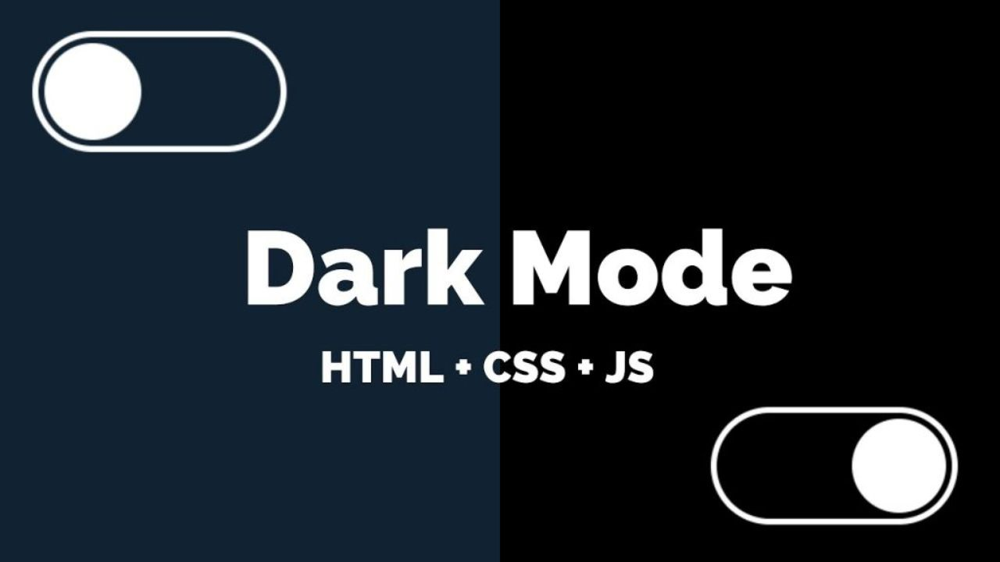

# Como Criar um Dark Mode Simples com CSS + JavaScript

## Estrutura de arquivos
```
📦 projeto/
 ┣ 📜 index.html
 ┣ 📜 style.css
 ┗ 📜 darkmode.js
```

## HTML de Exemplo

Vamos utilizar um HTML simples para aplicar o modo escuro, mas essa técnica pode
ser aplicada em qualquer outro documento HTML.

```html
<!DOCTYPE html>
<html lang="en">
  <head>
    <meta charset="UTF-8" />
    <meta name="viewport" content="width=device-width, initial-scale=1.0" />
    <title>Darkmode</title>
  </head>
  <body>
    <header>
      <h1>Some random website</h1>
      <p>
        Lorem ipsum dolor, sit amet consectetur adipisicing elit. Quidem, beatae voluptates iure iste eveniet, molestias
        rerum dicta accusantium dolore libero laboriosam aspernatur! Nobis ipsum id asperiores ullam illo consectetur
        aut odit quis ut beatae incidunt, esse sunt ratione distinctio labore!
      </p>
      <button class="cta-button">Go Premium</button>
      <button>More Info</button>
    </header>
    <section>
      <h2>About us</h2>
      <p>
        Lorem, ipsum dolor sit amet consectetur adipisicing elit. Iste facilis commodi aperiam aspernatur. Dolores, quis
        distinctio eos vero minima odio dolorem facere ab? Qui cum suscipit animi, nihil dignissimos nam minima tempora.
        Numquam doloribus, corporis culpa molestias provident vitae voluptatem recusandae, iste commodi est error qui
        enim, odit quisquam hic.
      </p>
      <button>Get in Touch</button>
    </section>
  </body>
</html>
```

## Definindo Cores com Variáveis CSS

Vamos criar o arquivo `style.css`. Começamos definindo nossas cores como 
**CSS custom properties** (variáveis) para facilitar a alteração entre temas:

```css
:root {
  --base-color: white;
  --base-variant: #e8e9ed;
  --text-color: #111528;
  --secondary-text: #232738;
  --primary-color: #3a435d;
  --accent-color: #0071ff;
}
```

Depois criamos a versão `darkmode`:

```css
.darkmode {
  --base-color: #070b1d;
  --base-variant: #101425;
  --text-color: #ffffff;
  --secondary-text: #a4a5b8;
  --primary-color: #3a435d;
  --accent-color: #0071ff;
}
```

Assim, ao adicionar a classe `darkmode` no `body`, todas as cores são trocadas 
automaticamente.

Vamos aproveitar e estilizar os demais elementos da nossa página já utilizando
as variáveis que definimos.

```css
* {
  margin: 0;
  padding: 0;
}
html {
  font-family: Poppins;
}
body {
  min-height: 100vh;
  background-color: var(--base-color);
  color: var(--text-color);
}
header,
section {
  padding: 70px min(50px, 7%);
}
section {
  background-color: var(--base-variant);
}
p {
  margin: 10px 0 20px 0;
  color: var(--secondary-text);
}
button {
  border: none;
  padding: 0.8em 2em;
  background-color: var(--primary-color);
  color: white;
  border-radius: 4px;
  font: inherit;
  text-transform: uppercase;
  font-weight: 500;
  cursor: pointer;
}
.cta-button {
  background-color: var(--accent-color);
}
```

E vamos colocar a referência ao arquivo de CSS no nosso arquivo `index.html`

```html
<link rel="stylesheet" href="style.css">
```

## Criando o Botão de Troca de Tema

No `index.html` temos um botão com dois ícones (um para claro e outro para 
escuro). Adicione esse código logo abaixo da tag `<header>`:

```html
<button id="theme-switch">
   <span>🌙</span>
   <span>☀️</span>
</button>
```

**No CSS**, usamos:
```css
#theme-switch {
  height: 50px;
  width: 50px;
  padding: 0;
  border-radius: 50%;
  background-color: var(--base-variant);
  display: flex;
  justify-content: center;
  align-items: center;
  position: fixed;
  top: 20px;
  right: 20px;
}
#theme-switch span:last-child {
  display: none;
}
```

Inicialmente nossa página vai ser no modo normal, sem o modo escuro e portanto
vamos mostrar o ícone para mudar para o modo escuro e esconder o ícone para o
modo não escuro.

Quando a classe `darkmode` está no body, vamos trocar os ícones via CSS.

Vamos adicionar um efeito *hover* ao passarmos o mouse sobre o ícone que muda
os temas:

```css
#theme-switch:hover {
  background-color: var(--accent-color);
  transition: background-color 0.2s ease;
}
```

E por fim temos que adicionar os estilos para quando estivermos no modo escuro:

```css
.darkmode #theme-switch span:first-child {
  display: none;
}
.darkmode #theme-switch span:last-child {
  display: block;
}
.darkmode #theme-switch {
  background-color: #3a435d;
  box-shadow: 0 0 12px rgba(0, 113, 255, 0.4);
}
```

Basicamente estamos invertendo a exibição dos ícones. No modo escuro é mostrado
o ícone do sol para mudar para o modo claro e escondemos a lua.

## Aplicando o Tema Dinamicamente com JavaScript

Vamos criar o arquivo `darkmode.js` com o seguinte conteúdo:

```javascript
let darkmode = localStorage.getItem('darkmode')
const themeSwitch = document.getElementById('theme-switch')

// Ativar o darkmode
const enableDarkMode = () => {
  document.body.classList.add('darkmode')
  localStorage.setItem('darkmode', 'active')
}

// Desativar o darkmode
const disableDarkMode = () => {
  document.body.classList.remove('darkmode')
  localStorage.setItem('darkmode', null)
}

// Se darkmode estava ativo antes, manter
if(darkmode === "active") enableDarkMode()

// Evento de clique no botão
themeSwitch.addEventListener("click", () => {
  darkmode = localStorage.getItem('darkmode')
  darkmode !== "active" ? enableDarkMode() : disableDarkMode()
})
```

E vamos adicionar a referência a ele antes da tag `<\head>`:

```html
 <script type="text/javascript" src="darkmode.js" defer></script>
```

**O que esse JS faz:**

- Verifica no `localStorage` se o darkmode estava ativo.
- Aplica a classe `darkmode` no `body` se sim.
- Troca entre `add` e `remove` da classe no clique do botão.
- Salva a escolha no `localStorage` para manter ao recarregar.

## Adicionando Transições Suaves

No CSS:

```css
body, button, header, section {
  transition: background-color 0.3s ease, color 0.3s ease;
}
```

Assim o visual troca de cor suavemente, sem solavancos.

## Resultado
- Tema claro por padrão.
- Dark Mode com clique.
- Ícone muda conforme o tema.
- Tema salvo no `localStorage` e mantido no próximo acesso.

## Ajuste Final

Se deixar configurado o modo escuro e carregarmos a página, vamos perceber que
ela fica piscando (para simular pressionar F5 várias vezes). Isso acontece pois
o HTML é carregado com o tema padrão (claro) e somente depois o Javascript
aplica o darkmode. É nesse intervalo que ocorre a piscada. Para resolver vamos
adicionar esse script antes de carregar o arquivo de estilos e o javascript
responsável por fazer o mudança de tema:

```html
<script>
  if (localStorage.getItem("darkmode") === "active") {
    document.documentElement.classList.add("darkmode");
  }
</script>
```

Vamos mudar o seletor que define as variáveis para o modo escuro:

```css
:root.darkmode {
...
}
```

Como adicionamos a classe `darkmode` no `documentElement` no início do nosso
HTML temos que mudar também nas funções responsáveis para alterar entre os temas
claro e escuro. Basta mudar o `document.body` para `document.documentElement`.

```js
const enableDarkMode = () => {
  document.documentElement.classList.add("darkmode");
  localStorage.setItem("darkmode", "active");
};

// Desativar o darkmode
const disableDarkMode = () => {
  document.documentElement.classList.remove("darkmode");
  localStorage.setItem("darkmode", null);
};
```

Pronto, assim resolvemos o problema do pisca-pisca ao carregar a página quando
configurada para o modo escuro.
